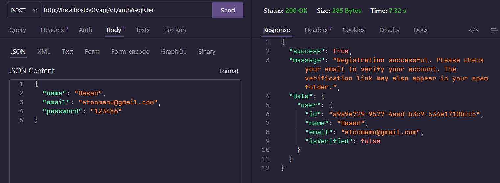
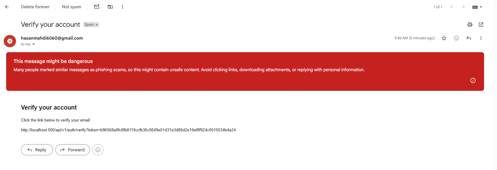
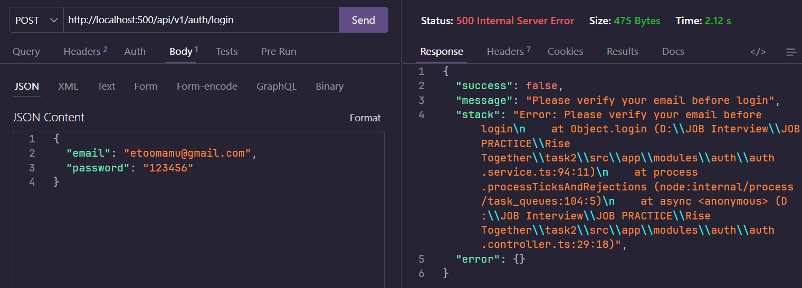
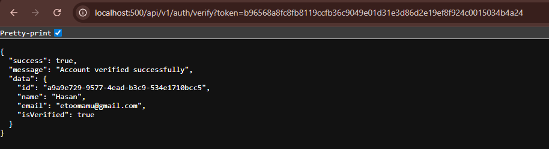
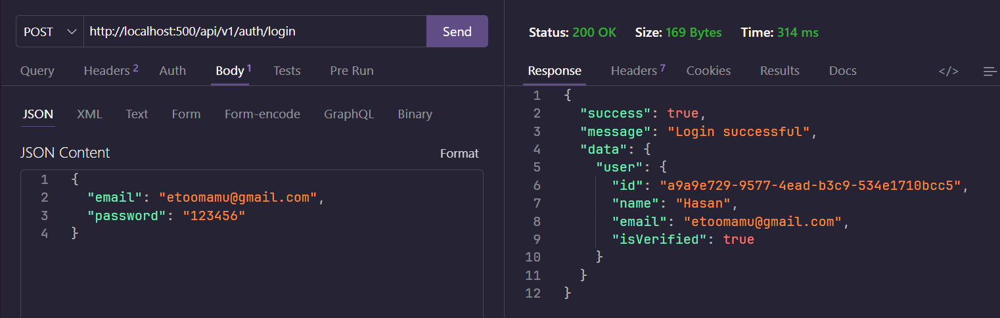
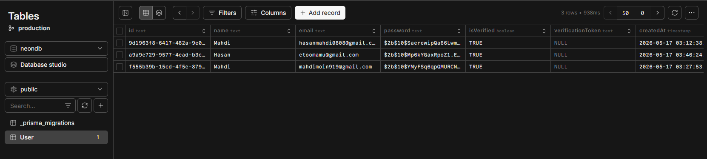

# Multi Vendor E-Commerce Database Design

## Project Overview

This project is a beginner-level multi-vendor e-commerce database design inspired by platforms like Daraz.

The main focus of this system is the **"Add Product" workflow** for vendors.

This database was designed using normalization concepts, relationships, constraints, and scalable structure thinking.

---

# Main Features

- Multi-role user system
- Vendor shop management
- Vendor KYC verification
- Product category & brand management
- Product variants support
- Multiple product images
- Product review & rating system
- Soft delete support
- RBAC (Role-Based Access Control)
- Product status management

---

# Database Tables

## User & Authentication

- users
- roles
- userRoles

## Vendor Management

- vendors
- vendorKYC

## Product Management

- products
- productVariants
- productImages
- categories
- brands

## Review System

- productReviews

---

# ER Diagram

DBDiagram Link:

[View ER Diagram on dbdiagram.io](https://dbdiagram.io/d/6a0627837a923b9472b9ef6c)

# SQL Interview Q&A 1 - 10

**1) What is the difference between Primary Key and Foreign Key?**

**Ans:**

💠 **Primary Key (PK)** :- It uniquely identifies every row of a table. Like -

```
---users---
id
name
```

Here the `id` is the Primary Key, because it won't be duplicate, null, and it identifies every user separately.

💠 **Foreign Key (FK)** :- It connects one table to another table. Like -

```
---products---
vendorId
```

Here the `vendorId` is the Foreign Key, because it references `vendors.id`.

So in short, Primary Key identifies its own table uniquely, and Foreign Key creates a relation to another table.

---

**2) Why is normalization important?**

**Ans:**

Normalization is important because —

- It decreases duplicate data
- It keeps the database clean
- It improves scalability
- It decreases inconsistency

**Example (Bad Design) :**

```
users
------
name
course1
course2
course3
```

⬆️ This is not scalable.

**Example (Normalized Design) :**

```
users
courses
enrollments
```

⬆️ Now it has a clean relation, reusable structure, and easy maintenance.

So in short, Normalization helps organize data efficiently by reducing duplication and improving database consistency.

---

**3) What is a JOIN?**

**Ans:**

JOIN is basically used for getting data from multiple tables.

**Example :**

```
-----------
products
vendors
```

If the product's vendor name is required, then we use JOIN.

**Example Concept :**

```
products.vendorId = vendors.id
```

Data is combined based on this relationship.

So in short, JOIN is used to combine related data from multiple tables using relationships like Primary Key and Foreign Key.

---

**4) What is the difference between SQL and MongoDB?**

**Ans:**

💠 **SQL** :- It is a relational database. It stores data in tables with rows and columns. Like -

```
---users---
id | name | email
```

Here the structure is fixed. We have to define the schema first, then insert data.

💠 **MongoDB** :- It is a non-relational database (NoSQL). It stores data in documents like JSON. Like -

```json
{
  "_id": "1",
  "name": "Mahdi",
  "email": "mahdi@gmail.com"
}
```

Here the structure is flexible. Every document can have different fields.

So in short, SQL is structured and table-based, and MongoDB is flexible and document-based. SQL is better for complex relations, MongoDB is better for flexible or large-scale data.

---

**5) What is a Composite Key?**

**Ans:**

Composite Key is when two or more columns together work as a Primary Key.

Example :

```
---enrollments---
userId
courseId
```

Here `userId` alone is not unique, and `courseId` alone is not unique. But `userId + courseId` together is unique, because one user can enroll in one course only once.

So in short, when a single column can't uniquely identify a row, we combine multiple columns to make a Composite Key.

---

**6) What is a Weak Entity?**

**Ans:**

A Weak Entity is an entity that can't be identified by its own. It depends on another entity to exist.

Example :

```
---orders---        ---orderItems---
id                  orderId
                    productId
```

Here `orderItems` is the Weak Entity, because without `orderId` it has no meaning. If the order is deleted, the order items also have no existence.

So in short, a Weak Entity depends on a Strong Entity to be identified. It can't exist alone.

---

**7) Why do we use Constraints?**

**Ans:**

Constraints are used to protect data quality in the database.

Example (Without Constraints) :

```
---users---
id: NULL          ❌
name: NULL        ❌
email: duplicate  ❌
```

⬆️ This creates dirty and inconsistent data.

Example (With Constraints) :

```
id     → PRIMARY KEY      (unique + not null)
name   → NOT NULL         (can't be empty)
email  → UNIQUE           (no duplicates)
age    → CHECK (age > 0)  (invalid value blocked)
```

⬆️ Now the data is always clean and valid.

So in short, Constraints make sure that wrong, duplicate, or empty data can't enter the database.

---

**8) Explain Many-to-Many Relationship.**

**Ans:**

Many-to-Many is when multiple rows of one table are related to multiple rows of another table.

Example :

```
---users---        ---courses---
id                 id
name               title
```

One user can enroll in many courses, and one course can have many users. So it's a Many-to-Many relationship.

But we can't connect them directly. We need a middle table called a **Junction Table**. Like -

```
---enrollments---
userId
courseId
```

So in short, Many-to-Many relationship connects two tables where both sides can have multiple relations, and we always need a junction table to handle it.

---

**9) What is the difference between Clustered and Non-Clustered Index?**

**Ans:**

💠 **Clustered Index** :- It physically sorts and stores the table data based on the index. Like -

```
---users---
id (Clustered Index)
```

Here the rows are physically stored in the order of `id`. A table can have only **one** Clustered Index, because the data can be physically sorted in only one way.

💠 **Non-Clustered Index** :- It creates a separate structure that points to the actual data. Like -

```
---users---
email (Non-Clustered Index)
```

Here the data is not physically sorted by email. The index just stores the email values with pointers to the actual rows. A table can have **multiple** Non-Clustered Indexes.

So in short, Clustered Index sorts the actual data physically, and Non-Clustered Index is a separate pointer structure. Clustered is faster for range queries, Non-Clustered is flexible but takes extra storage.

---

**10) Explain Database Sharding and Partitioning. When would you use each?**

**Ans:**

💠 **Partitioning** :- It splits a large table into smaller pieces, but all pieces stay in the **same database**. Like -

```
---orders_2023---
---orders_2024---
---orders_2025---
```

Here the `orders` table is too large, so we split it by year. It's still in the same server. It improves query performance because now the database searches a smaller chunk.

▪️ Use Partitioning when — your table is too large and queries are getting slow, but one server is still enough.

💠 **Sharding** :- It splits the data across **multiple databases or servers**. Like -

```
Server 1 → users from Bangladesh
Server 2 → users from USA
Server 3 → users from India
```

Here each server has its own data. No single server holds everything. It improves scalability when one server can't handle the load.

▪️ Use Sharding when — your data or traffic is so large that even one powerful server is not enough.

So in short, Partitioning splits data inside one server, Sharding splits data across multiple servers. Partitioning is for performance, Sharding is for massive scale.

# SQL Interview Q&A 11 - 20

---

**11) What is the difference between DELETE, TRUNCATE and DROP?**

**Ans:**

💠 **DELETE** :- It remove specific rows from a table. Like -

```sql
DELETE FROM users WHERE id = 5;
```

Here only the user with id 5 is deleted. Other rows are safe. And we can ROLLBACK it (undo it).

💠 **TRUNCATE** :- It remove all rows from a table at once. But the table structure is still there. Like -

```sql
TRUNCATE TABLE users;
```

Here all data is gone but the `users` table still exist. We can't ROLLBACK it.

💠 **DROP** :- It remove the full table. Data and structure both are gone. Like -

```sql
DROP TABLE users;
```

Here the `users` table is completely deleted. Nothing left.

So in short —

- DELETE = specific rows delete (undo possible)
- TRUNCATE = all rows delete but table exist (undo not possible)
- DROP = full table delete (nothing left)

---

**12) What is a PRIMARY KEY?**

**Ans:**

Primary Key is a column that uniquely identify every row of a table.

Rules :

- it can't be NULL
- it can't be duplicate

Example :

```
---users---
id (PRIMARY KEY)
name
email
```

Here `id` is the Primary Key. cz every user has a different id. No two users share the same id.

So in short, Primary Key uniquely identify every single row in a table.

---

**13) What is the difference between PRIMARY KEY and UNIQUE KEY?**

**Ans:**

💠 **PRIMARY KEY** :-

- Only one PRIMARY KEY per table
- Can't be NULL
- Uniquely identify every row

💠 **UNIQUE KEY** :-

- Multiple UNIQUE KEY allowed in one table
- Can be NULL (but only once)
- Also unique, but not the main identifier

Example :

```
---users---
id     → PRIMARY KEY  (main identifier, not null)
email  → UNIQUE KEY   (unique but not the main key)
```

So in short, PRIMARY KEY is the main unique identifier. UNIQUE KEY just make sure the value won't duplicate, but it's not the main key.

---

**14) What is a FOREIGN KEY?**

**Ans:**

Foreign Key is a column that connect one table to another table. It reference the PRIMARY KEY of another table.

Example :

```
---products---
productId
name
vendorId  → FOREIGN KEY (reference vendors.id)
```

```
---vendors---
id  → PRIMARY KEY
name
```

Here `vendorId` in products table is a Foreign Key. cz it's pointing to `id` of vendors table. So we know which product belong to which vendor.

So in short, Foreign Key create a relation between two tables using Primary Key reference.

---

**15) What is JOIN in SQL? Explain INNER JOIN and LEFT JOIN.**

**Ans:**

JOIN is used for getting data from multiple tables at the same time using their relationship.

Example tables :

```
---users---          ---orders---
id | name            orderId | userId | item
```

💠 **INNER JOIN** :- It return only the rows that have matching data in both tables.

```sql
SELECT users.name, orders.item
FROM users
INNER JOIN orders ON users.id = orders.userId;
```

Here only the users who have orders will show. If a user have no order, they won't appear.

💠 **LEFT JOIN** :- It return all rows from the left table, and matching rows from the right table. If no match, it show NULL.

```sql
SELECT users.name, orders.item
FROM users
LEFT JOIN orders ON users.id = orders.userId;
```

Here all users will show. If a user have no order, their order column will show NULL.

So in short —

- INNER JOIN = only matched rows from both tables
- LEFT JOIN = all rows from left table + matched rows from right table

---

**16) What is normalization? Explain 1NF, 2NF, 3NF.**

**Ans:**

Normalization is the process of organizing a database to reduce duplicate data and keep it clean and consistent.

💠 **1NF (First Normal Form)** :- Every column should have single value. No multiple values in one column.

Bad design :

```
---users---
name | courses
Mahdi | "HTML, CSS, JS"   ❌
```

Good design (1NF) :

```
---users---
name  | course
Mahdi | HTML
Mahdi | CSS
Mahdi | JS
```

⬆️ Now every column has a single value.

💠 **2NF (Second Normal Form)** :- It must be in 1NF first. And every non-key column should depend on the full Primary Key, not just part of it.

Example : if Composite Key is `userId + courseId`, then `courseName` should depend on `courseId` only, not the full key.

So we separate it :

```
---courses---
courseId | courseName
```

⬆️ Now courseName depend on courseId fully.

💠 **3NF (Third Normal Form)** :- It must be in 2NF first. And no non-key column should depend on another non-key column.

Bad design :

```
---users---
id | zipCode | city   ❌
```

Here `city` depend on `zipCode`, not on `id`. That's bad.

Good design (3NF) :

```
---users---        ---locations---
id | zipCode       zipCode | city
```

⬆️ Now city is in a separate table.

So in short —

- 1NF = single value in every column
- 2NF = every column depend on full primary key
- 3NF = no column depend on another non-key column

---

**17) What is indexing? Why do we use index?**

**Ans:**

Index is like a shortcut in the database to find data faster. Think of it like the index page of a book — you don't read the whole book to find a topic, you just check the index.

Example :

```sql
CREATE INDEX idx_email ON users(email);
```

Now if you search by email, the database won't check every row. It will use the index and find it fast.

Why we use index :

- ▪️ It make search queries much faster
- ▪️ It improve performance on large tables
- ▪️ It help WHERE, JOIN, ORDER BY work efficiently

But index also have a downside — it take extra storage and make INSERT/UPDATE a little slower. cz the index also need to update every time.

So in short, Index help database find data faster without scanning every row. We use it on columns that we search or filter a lot.

---

**18) What is the difference between WHERE and HAVING?**

**Ans:**

💠 **WHERE** :- It filter rows before grouping. It work on individual rows.

```sql
SELECT * FROM users WHERE age > 18;
```

Here rows are filtered first, then result is returned.

💠 **HAVING** :- It filter rows after grouping. It work with GROUP BY and aggregate functions like COUNT, SUM, AVG.

```sql
SELECT city, COUNT(*) as total
FROM users
GROUP BY city
HAVING COUNT(*) > 10;
```

Here first users are grouped by city, then cities with more than 10 users are shown.

So in short —

- WHERE = filter before grouping (works on rows)
- HAVING = filter after grouping (works on grouped result)

---

**19) What is a transaction in SQL? Explain COMMIT and ROLLBACK.**

**Ans:**

Transaction is a group of SQL operations that run together as one unit. Either all of them succeed, or none of them happen.

Example : when you transfer money —

```
Step 1 : deduct 500 from account A
Step 2 : add 500 to account B
```

If step 1 success but step 2 fail, that's a big problem. So we use transaction — if anything fail, everything undo.

💠 **COMMIT** :- It save all the changes permanently.

```sql
BEGIN;
UPDATE accounts SET balance = balance - 500 WHERE id = 1;
UPDATE accounts SET balance = balance + 500 WHERE id = 2;
COMMIT;  -- now changes are saved
```

💠 **ROLLBACK** :- It undo all the changes if something go wrong.

```sql
BEGIN;
UPDATE accounts SET balance = balance - 500 WHERE id = 1;
-- something went wrong...
ROLLBACK;  -- everything is undone, no change happened
```

So in short —

- Transaction = group of operations that run together
- COMMIT = save the changes
- ROLLBACK = undo the changes

---

**20) Write a query to find the second highest salary.**

**Ans:**

Example table :

```
---employees---
id | name  | salary
1  | Mahdi | 50000
2  | Rakib | 70000
3  | Sajid | 60000
```

**Method 1 : Using LIMIT and OFFSET**

```sql
SELECT salary FROM employees
ORDER BY salary DESC
LIMIT 1 OFFSET 1;
```

Here we sort salaries from high to low, skip the first one (highest), then take the next one (second highest).

---

# Prisma ORM Interview Q&A

---

**1) What is Prisma ORM and why is it used in backend development?**

**Ans:**

Prisma is a tool that help us interact with database using JavaScript/TypeScript code instead of writing raw SQL queries.

ORM means — Object Relational Mapper. It basically map our database tables to code objects, so we don't have to write SQL manually.

Example : Without Prisma we have to write —

```sql
SELECT * FROM users WHERE id = 1;
```

But with Prisma we can write —

```ts
const user = await prisma.user.findUnique({ where: { id: 1 } });
```

Same result, but now it's just TypeScript code. Much cleaner and easier.

Why we use Prisma in backend :

- ▪️ No need to write raw SQL
- ▪️ It give us auto-completion and type safety
- ▪️ It manage database schema easily
- ▪️ It work with PostgreSQL, MySQL, MongoDB and more

So in short, Prisma is a tool that let us work with database using clean TypeScript code instead of raw SQL queries.

---

**2) What is the difference between findUnique() and findFirst() in Prisma?**

**Ans:**

💠 **findUnique()** :- It find a single row by a unique field. Like `id` or `email`. If the field is not unique, it will throw an error.

```ts
const user = await prisma.user.findUnique({
  where: { id: 1 },
});
```

Here it search by `id` which is unique. It will return one user or `null`.

💠 **findFirst()** :- It find the first row that match the condition. The field doesn't have to be unique.

```ts
const user = await prisma.user.findFirst({
  where: { name: 'Mahdi' },
});
```

Here it search by `name` which can be duplicate. It will return the first match or `null`.

So in short —

- findUnique() = search by unique field only (like id, email)
- findFirst() = search by any field, return first match

---

**3) What is Prisma Migration and why is prisma migrate dev used?**

**Ans:**

Migration means — when we change our database schema (like add a new column, create a new table), we need to apply those changes to the actual database. Migration do this for us.

Think of it like — we wrote the plan in `schema.prisma` file, and migration actually execute that plan in the database.

**Why we use `prisma migrate dev` :**

```bash
npx prisma migrate dev --name add_email_column
```

When we run this command —

- ▪️ It create a new migration file with the changes
- ▪️ It apply those changes to the database automatically
- ▪️ It also regenerate the Prisma Client so our code stay updated

Example : we added `age` field in schema.prisma —

```prisma
model User {
  id    Int    @id @default(autoincrement())
  name  String
  age   Int     ← new field added
}
```

Now we run `prisma migrate dev` — it will add the `age` column in the real database.

So in short, `prisma migrate dev` apply our schema changes to the actual database and keep everything in sync.

---

**4) Explain the difference between select and include in Prisma with examples.**

**Ans:**

💠 **select** :- It let us choose which specific fields we want to return. Only those fields will come — nothing else.

```ts
const user = await prisma.user.findUnique({
  where: { id: 1 },
  select: {
    name: true,
    email: true,
  },
});
```

Result :

```json
{ "name": "Mahdi", "email": "m@gmail.com" }
```

Here only `name` and `email` came. `id` or other fields didn't come cz we didn't select them.

💠 **include** :- It let us include related data from another table. Like bringing related records using Foreign Key relation.

Example : one user has many posts —

```ts
const user = await prisma.user.findUnique({
  where: { id: 1 },
  include: {
    posts: true,
  },
});
```

Result :

```json
{
  "id": 1,
  "name": "Mahdi",
  "posts": [
    { "id": 101, "title": "My first post" },
    { "id": 102, "title": "My second post" }
  ]
}
```

Here the user came with all their posts included.

So in short —

- select = choose specific fields of the same table
- include = bring related data from another table

---

**5) What is the purpose of the Prisma schema file (schema.prisma) and what are its main sections?**

**Ans:**

`schema.prisma` is the main configuration file of Prisma. It describe our database structure — what tables we have, what columns they have, and how they are related to each other.

Think of it like a blueprint of our database.

**Main sections of schema.prisma :**

💠 **generator** :- It define what Prisma will generate. We mostly use `prisma-client-js` here — it generate the Prisma Client that we use in our code.

```prisma
generator client {
  provider = "prisma-client-js"
}
```

💠 **datasource** :- It define which database we are connecting to and the connection URL.

```prisma
datasource db {
  provider = "postgresql"
  url      = env("DATABASE_URL")
}
```

Here `provider` is the database type (postgresql, mysql, mongodb etc.) and `url` is the connection string we keep in `.env` file.

💠 **model** :- It define our tables and their columns. Each model = one table in the database.

```prisma
model User {
  id    Int    @id @default(autoincrement())
  name  String
  email String @unique
  posts Post[]
}

model Post {
  id     Int  @id @default(autoincrement())
  title  String
  userId Int
  user   User @relation(fields: [userId], references: [id])
}
```

Here `User` and `Post` are two tables. `Post` has a relation to `User` using Foreign Key.

So in short, `schema.prisma` has three main sections —

- generator = what to generate (Prisma Client)
- datasource = which database and connection URL
- model = table structure and relations

---

# API Testing Screenshots

## User Register API Result



---

## Verification Email



---

## Unverified User Login Attempt



---

## User Verification API Result



---

## User Login API Result



---

## Database User Table



# SQL Practice Task Link

[Repo Link](https://github.com/mahdi9162/sql-practice.git)

# Mongoose Practice Task Link

[Repo Link](https://github.com/mahdi9162/rise-commerce-api-mongoose.git)
